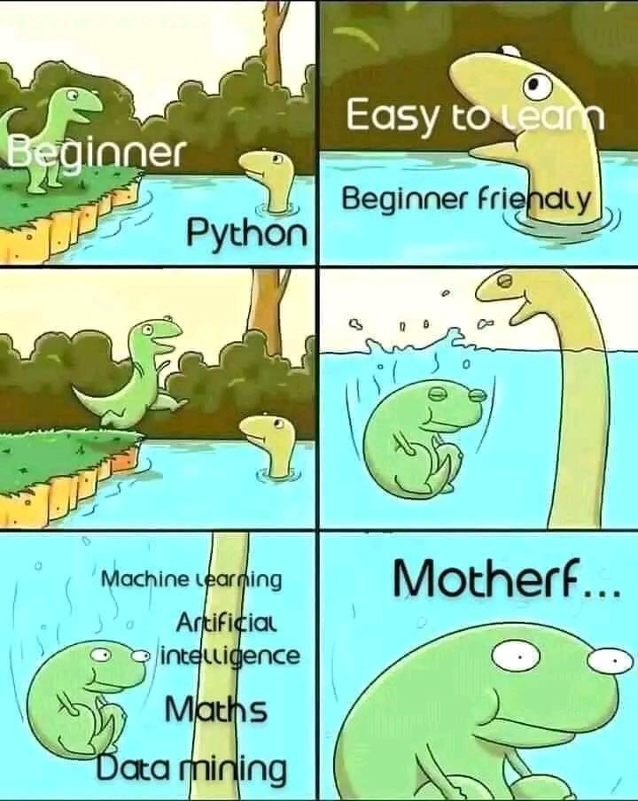

# Data-Science-Workshop

During our 4th semester, we conducted a Data Science workshop at phoenix college, delving into the realm of data and acquiring knowledge of various machine learning algorithms.

---

**Special Guest Speaker:**

- **Kanchan Bhatt** - [LinkedIn Profile](https://www.linkedin.com/in/itskanchanthings/))
  - Data Scientist at [Alphateds Company](https://alphateds.com/))

Kanchan Bhatt, a data scientist at Alphateds Company, shared valuable real-world experiences in data science during our workshop. His insights into problem-solving in data science were immensely beneficial to us as students.

If you notice any mistakes or have suggestions for improvements in this repository, please feel free to create a pull request. We welcome your feedback and will happily review and merge any contributions.

